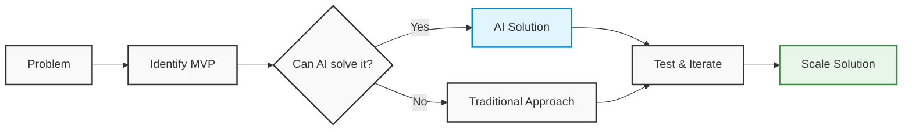

# Sahar Carmel | Principal AI Engineer 👨‍💻

## 🤖 About Me

Principal AI Engineer specializing in LLM-powered solutions. I focus on AI-first development and creating reliable technology solutions efficiently, following lean startup principles to deliver value quickly.

> **"Building x100 solutions by finding the minimal viable approach first, then iterating rapidly."**

## 🎯 My Approach

## 🛠️ Tech Stack

## 📈 GitHub Stats

## 🌟 Featured Project

### [TheAlmanac](https://github.com/SaharCarmel/TheAlmanac)
An MCP (Multi-purpose Companion for Productivity) for downloading and interacting with documentation, enhancing developer productivity through AI-powered assistance.

## 📫 Connect With Me

